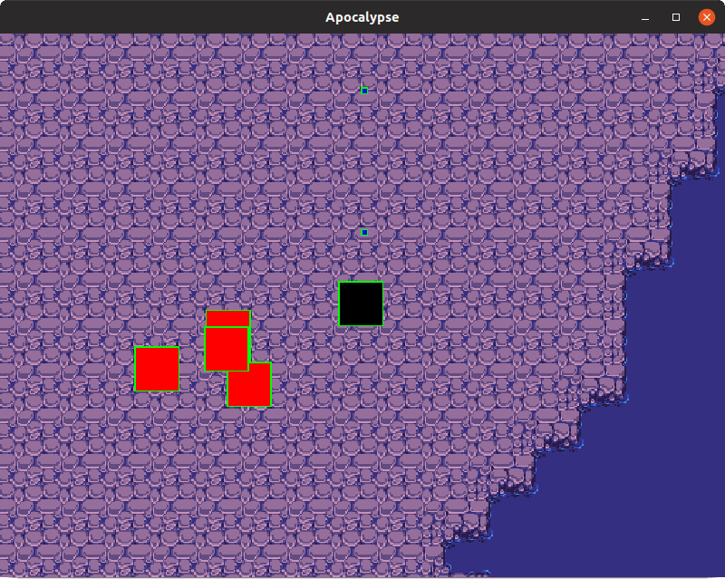

Apocalypse is a simple game developed in C/C++ using SDL2 library for video rendering, event handling, threads etc.

## Getting started

Currently, the game is still under development and looks like this:

The graphics are not completed yet and most of the image above is just placeholder for future graphics.

## Built With

* [SDL2.0](https://https://www.libsdl.org/) - Simple DirectMedia Layer
* [Retro Gaming font](https://www.dafont.com/pt/vasily.d7345) - Font used in game
* [tinyxml2](https://leethomason.github.io/tinyxml2/) - Library used for opening XML files
* [Tiled map editor](https://www.mapeditor.org/) - Map editor

## Authors

* **Ícaro Freire** - *Programming and game logic* - [ivfreire](https://github.com/ivfreire)

## License

This project is licensed under the GNU License - see the [LICENSE.md](LICENSE.md) file for details

## Acknowledgments

* Hat tip to the Hackerspace team of IFUSP (Institute of Physics of the University of São Paulo).
